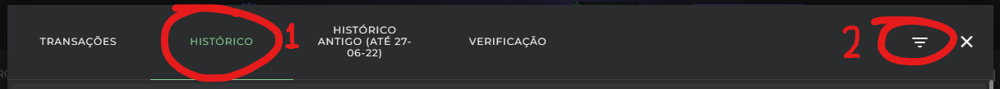
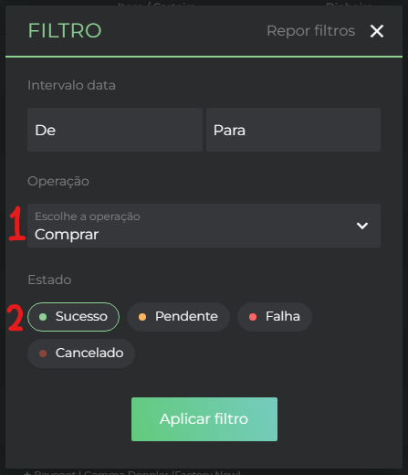
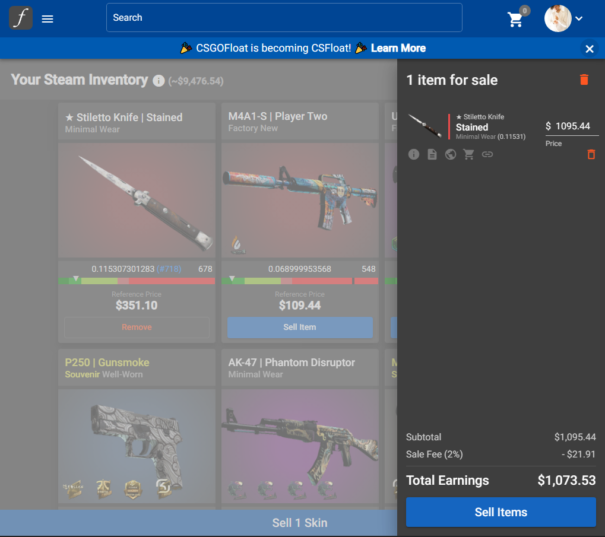
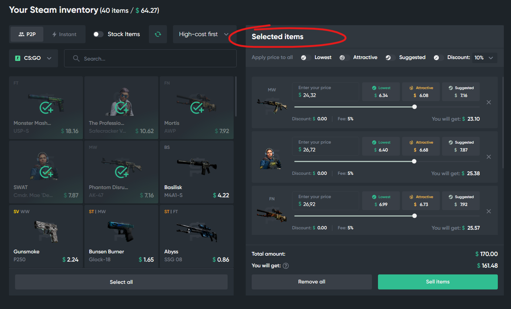

# DISCLAIMER

Esse repositório não é para propósitos gerais. Tem uma aplicação bem específica baseada no meu modelo pessoal. Está aqui no github apenas para facilitar o compartilhamento com meus amigos.

# USING

Copie o código do site que for necessário.
Vá até a pagina respectiva (vide lista abaixo), pressione `Ctrl + shift + I`, vá até a aba console, cole o código e aperte `Enter`
- getListFromBuff.js -> [Buff163 history](https://buff.163.com/market/buy_order/history?game=csgo&state=success)
- getListFromDmarket.js -> [DMarket history](https://dmarket.com/pt/ingame-items/item-list/csgo-skins?exchangeTab=myItems)
  - Clique no ícone indicado
  - 
  - Na janela que abrirá na sua tela:
  - Clique em `HISTÓRICO` (1), em seguida no botão de filtro (2)
  - 
  - Na janela que se abrirá, filtre por operação: apenas `Comprar`, e por estado: apenas `Sucesso`. A janela deve se parecer com a seguinte imagem:
  - 
- getListFromFloat.js -> [CSFloat trades](https://csfloat.com/profile/trades)
- listItemsBuff.js -> [Buff163 inventory](https://buff.163.com/market/steam_inventory?game=csgo#page_num=1&page_size=50&search=&state=cansell)
- listItemsCSFloat.js -> [CSFloat sell](https://csfloat.com/sell)
  - A barra lateral deve estar aparecendo, como na imagem, para que o script funcione corretamente.
  - 
- listItemsShadowpay.js -> [Shadowpay sell](https://shadowpay.com/en/sell)
  - Apenas selecione as skins que deseja vender e rode o script. A aba `Selected items` tem que estar aparente, como na imagem, para que o código funcione.
  - 
- listItemsWaxpeer.js -> [Waxpeer inventory](https://waxpeer.com/manage/inventory)
  - Selecione as skins que deseja vender, clique no botão `Set prices` na esquerda inferior da página e rode o script.